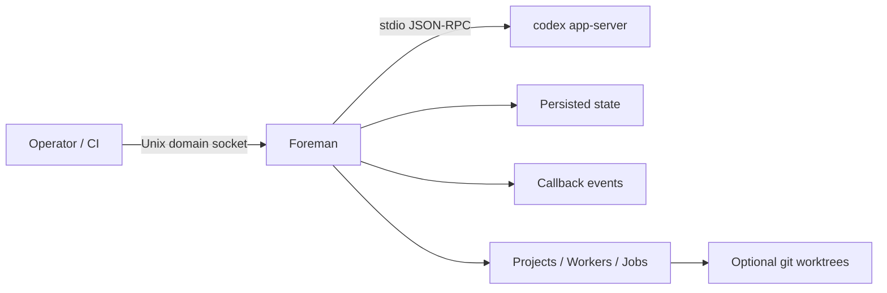

# foreman

[](https://github.com/cmdruid/foreman/actions/workflows/ci.yml)
[](https://github.com/cmdruid/foreman/actions/workflows/release.yml)
[](https://github.com/cmdruid/foreman/blob/main/LICENSE)
[](https://github.com/cmdruid/foreman/releases)
[](SECURITY.md)

## Foreman: the control room for your AI assembly line

When agent work starts looking like a messy shop floor, you need process discipline.
**Foreman** is that floor manager for Codex: one service that keeps multiple agents moving through a repeatable workflow with measurable outputs.

No improvisation. No mystery routing. No stalled lines waiting on unclear instructions.

You define the order ticket (task payload), Foreman moves it through execution, monitoring, callbacks, and completion.

## What Foreman delivers

### For humans

- **Higher throughput, predictable output**
  Orchestrate many agents from a single API surface.
- **Built for reliability**
  Local `codex app-server` transport, persisted state, and restart recovery.
- **Quality gates on every batch**
  Release checks, live smoke scenarios, and docs for repeatable validation.
- **Fast proof on delivery**
  Run real mock scenarios and see concrete artifacts without waiting weeks.

### For agents and automation

- **Explicit work orders, no guesswork**
  `jobs` and `workers` are explicit, ordered instructions.
- **Clean interface boundaries**
  Separate lanes for `agents`, `projects`, and `jobs`.
- **Event visibility at each step**
  Callback emissions keep downstream systems informed on turn and completion events.
- **Isolated outputs when needed**
  Optional worktree execution keeps deliverables separated.

## Foreman process map



## Start the line (3-minute onboarding)

### 1) Start Foreman

```bash
cargo build

cargo run -- \
  --codex-binary /usr/local/bin/codex \
  --service-config /etc/foreman/config.toml \
  --project /path/to/project/project.toml
```

### 2) Validate the setup

```bash
cargo run -- --service-config /etc/foreman/config.toml --validate-config
```

### 3) Generate a starter project template

```bash
cargo run -- --init-project /tmp/example-project
cargo run -- --init-project /tmp/example-project --init-project-manual
cargo run -- --init-project /tmp/example-project --init-project-overwrite
```

Template directory defaults to `templates/`. Override when your plant has custom manifests:

```bash
--template-dir /usr/share/foreman/templates
# or
export CODEX_FOREMAN_TEMPLATE_DIR=/usr/share/foreman/templates
```

## Operations API

Use these endpoints as your control panels:

- `GET /health`, `GET /status`
- `POST /agents`, `GET /agents`, `GET /agents/:id`, `GET /agents/:id/result`, `GET /agents/:id/wait`, `GET /agents/:id/events`
- `POST /agents/:id/send`, `POST /agents/:id/steer`, `POST /agents/:id/interrupt`, `DELETE /agents/:id`
- `POST /projects`, `GET /projects`, `GET /projects/:id`, `DELETE /projects/:id`
- `GET /projects/:id/callback-status`
- `POST /projects/:id/workers`
- `POST /projects/:id/foreman/send`, `POST /projects/:id/foreman/steer`
- `POST /projects/:id/compact`
- `POST /projects/:id/jobs`, `GET /jobs`, `GET /jobs/:id`, `GET /jobs/:id/result`, `GET /jobs/:id/wait`

Keep instructions explicit in each worker item. That is how you keep outputs deterministic across runs.

For full endpoint schemas and examples, see [`docs/manual.md`](docs/manual.md).

## Live proof run (the acceptance test)

Run the included mock project and verify end-to-end artifact generation:

```bash
./contrib/demo/run_demo.sh
```

Default `run_demo.sh` mode is `worktree` (all worktree-backed workers).

```bash
RUN_MOCK_DEMO_MODE=worktree ./contrib/demo/run_demo.sh
```

Mixed mode example (explicit mix of worktree and non-worktree workers):

```bash
RUN_MOCK_DEMO_MODE=mixed \
WORKTREE_CLEANUP=true \
./contrib/demo/run_demo.sh
```

Acceptance criteria:

- process exits `0`
- final output includes `result: success`
- in `worktree` mode: 3 workers complete and artifacts are present under `contrib/demo/.audit/reports/`
- in `mixed` mode: 4 workers complete and artifacts are present under `contrib/demo/.audit/reports/`

Helper script:

- `./contrib/demo/run_mixed.sh` remains as a helper that sets `RUN_MOCK_DEMO_MODE=mixed`.

If you need heavier validation, treat this as your pre-scale production check.

## Core configuration

### app-server and protocol

```toml
[app_server]
initialize_timeout_ms = 5_000
request_timeout_ms = 30_000

[protocol]
expected_codex_version = "0.9.2"
```

### worker monitoring

```toml
[worker_monitoring]
enabled = false
inactivity_timeout_ms = 3_000
max_restarts = 1
watch_interval_ms = 750
```

### optional auth

```toml
[security.auth]
enabled = true
token = "replace-me"
header_name = "authorization"
# header_scheme = "Bearer"
# skip_paths = ["/health"]
```

### callback profile (command)

```toml
[callbacks]
default_profile = "openclaw"

[callbacks.profiles.openclaw]
type = "command"
program = "/usr/local/bin/openclaw-callback"
args = ["--message", "{{event_prompt}}", "--thread-id", "{{thread_id}}"]
prompt_prefix = "Handle this event payload from codex:\n"
event_prompt_variable = "message"
timeout_ms = 10_000
```

For webhook integrations, configure `type = "webhook"`, `url`, `secret_env`, and event filters.

## Operating requirements

To keep the line moving, provide:

- unix socket filesystem permission for `--socket-path`
- permission to start child `codex app-server`
- permission to access `<project-file>.toml` and derived `--state-path` location (typically `<project-dir>/.foreman/foreman-state.json`)
- workspace and callback execution rights when callbacks are used

If your environment is locked down, grant these before starting Foreman.

## Release readiness checklist

- `./scripts/release_gate.sh`
- `cargo test --test release -- --nocapture`
- `cargo fmt --all -- --check`
- `cargo clippy --all-targets -- -D warnings`

Reference docs:

- [`RELEASE.md`](RELEASE.md)
- [`RELEASES.md`](RELEASES.md)
- [`TESTING.md`](TESTING.md)

## Contributing

Bring production-minded changes:

- keep PRs focused,
- update test/fixtures for API contract changes,
- keep prompts and payloads explicit and traceable.

See [`CONTRIBUTING.md`](CONTRIBUTING.md).

## Additional docs

- Manual: [`docs/manual.md`](docs/manual.md)
- Testing: [`TESTING.md`](TESTING.md)
- Releases: [`RELEASES.md`](RELEASES.md)
- Release checklist: [`RELEASE.md`](RELEASE.md)
- Changelog: [`CHANGELOG.md`](CHANGELOG.md)
- Security policy: [`SECURITY.md`](SECURITY.md)
